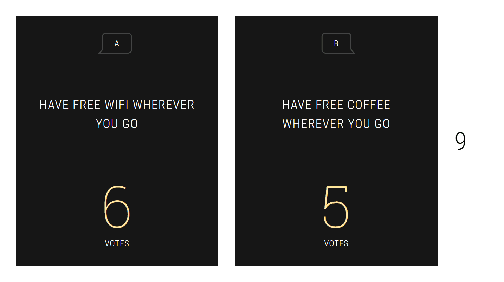

# Would They Rather?

A game I made meant to be played with a large group of people for a church youth group event.

## Technologies used

* Node.js and Express for the backend
* Jest for tests
* Socket.io for realtime data
* React for running the front end
* Parcel for bundling and building the frontend
* Twilio SMS for handling the voting process itself

## How the game works

1. Call a person on stage. They can't see the screen.
2. Select a "Would they rather?" question to display on the screen. For example "Have free wifi wherever you go" or "Have free coffee wherever you go". The person on stage should still not see what it is.
3. The crowd participates by texting "A" or "B" depending on which they think the person on stage will choose
4. At the end of a timer the person on stage picks one of the two options
5. Tables are assigned points based on how many people from that table voted correctly on their phones. (During the setup people text in what their table numbers are)

## Setup

I wrote this so long ago that I don't remeber all the steps required exactly. I also didn't use the best practices out there haha.
But if you at least want to get this running locally on a test mode:

1. `nvm use` for Node 12 and `npm install`
2. `node index.js` to run the app on port 8080
3. On another terminal instance run `node test-utils/start-and-vote` to run through a test scenario

I had to rush the end of this because I was running out of time before the actual event. So a lot of the code is messy, and things like the tests don't actually pass with the current implementation.

## Fun fact

It was through this game that I learned the hard way to not spam Twilio SMS numbers with hundreds of text messages at once. It didn't like it very much and got super throttled :sweat: